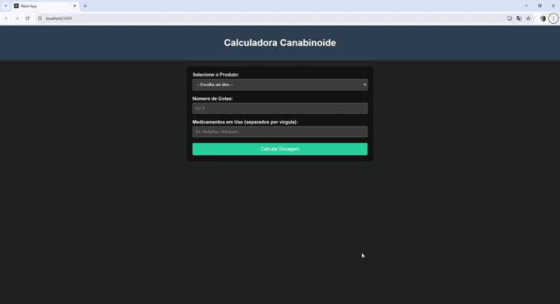

# Calculadora Canabinoide - Projeto Full-Stack


Este é um projeto de portfólio que demonstra a criação de uma aplicação web full-stack, utilizando uma arquitetura moderna com Java/Spring Boot no backend e React no frontend.

## 🚀 Sobre o Projeto

A **Calculadora Canabinoide** é uma ferramenta desenvolvida para auxiliar médicos e pacientes no controle da dosagem de tratamentos à base de cannabis medicinal. A aplicação permite que o usuário selecione um produto com composição específica, informe a quantidade de gotas desejada e receba como retorno a dosagem exata em miligramas de cada canabinoide (CBD, THC, etc.).

O objetivo é automatizar e simplificar um processo que hoje é feito manualmente, aumentando a segurança e precisão das prescrições médicas.



## 🏛️ Estrutura do Repositório (Monorepo)

Este repositório utiliza uma abordagem de monorepo para gerenciar os dois componentes principais da aplicação:

-   `./backend`: Contém a API RESTful construída com **Java e Spring Boot**. É responsável por todas as regras de negócio, lógica de cálculo, comunicação com o banco de dados e gerenciamento dos produtos.
-   `./frontend`: Contém a interface do usuário (UI) construída com **React**. É uma Single Page Application (SPA) que consome os endpoints da API do backend para fornecer uma experiência interativa e responsiva ao usuário.

## 💻 Tecnologias Utilizadas

| Camada  | Tecnologia                                           |
| :------ | :--------------------------------------------------- |
| **Backend** | Java 17, Spring Boot 3, Spring Data JPA, Hibernate |
| **Frontend**| React 18, JavaScript (ES6+), HTML5, CSS3          |
| **Banco de Dados**| MySQL com migrações gerenciadas por Flyway         |
| **Build**   | Maven (Backend) e npm (Frontend)                   |

## ⚙️ Como Executar o Projeto

Siga os passos abaixo para executar a aplicação completa em seu ambiente local.

### Pré-requisitos
- JDK 17 ou superior
- Apache Maven 3.8+
- Node.js 16+ e npm
- MySQL Server 8.0+

### 1. Configurando o Banco de Dados
- Crie um banco de dados no MySQL com o nome `calculadora_db`.
- Atualize as credenciais do banco no arquivo `/backend/src/main/resources/application.properties` se necessário:

```properties
spring.datasource.url=jdbc:mysql://localhost:3306/calculadora_db
spring.datasource.username=seu_usuario
spring.datasource.password=sua_senha
```

### 2. Executando o Backend (API)
Abra um terminal na raiz do projeto e execute os seguintes comandos:

```bash
# Navegue para a pasta do backend
cd backend

# Use o Maven Wrapper para iniciar a aplicação
./mvnw spring-boot:run
```
O servidor do backend estará rodando em `http://localhost:8080`. O Flyway criará as tabelas automaticamente na primeira inicialização.

### 3. Executando o Frontend (UI)
Abra um **novo terminal** na raiz do projeto e execute os seguintes comandos:

```bash
# Navegue para a pasta do frontend
cd frontend

# Instale as dependências do projeto (apenas na primeira vez)
npm install

# Inicie o servidor de desenvolvimento do React
npm start
```
A interface da aplicação estará acessível em `http://localhost:3000` no seu navegador.

---
*Projeto desenvolvido como parte do meu portfólio de programação. Sinta-se à vontade para explorar o código!*
